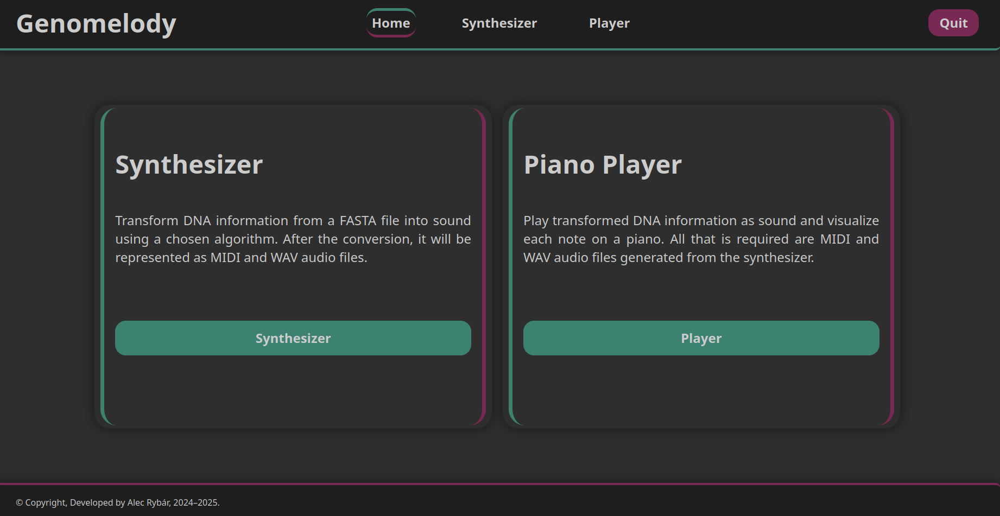
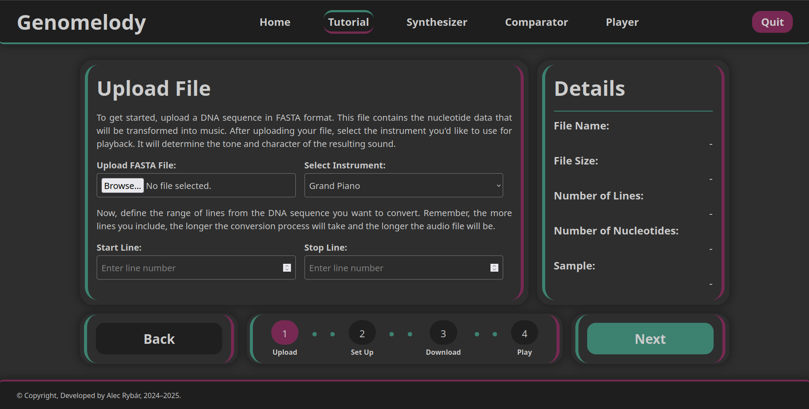
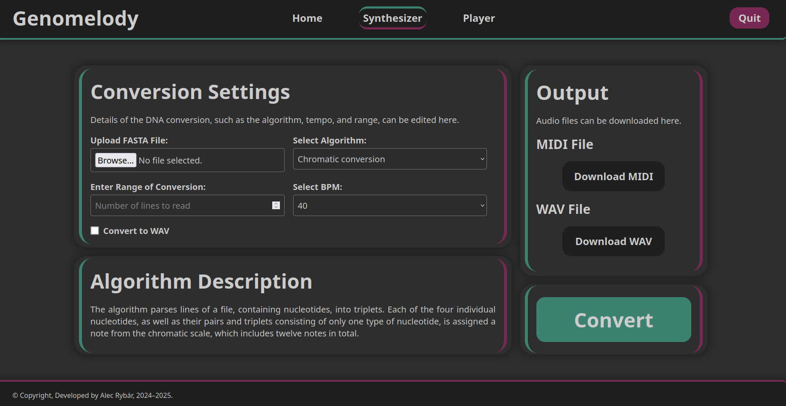
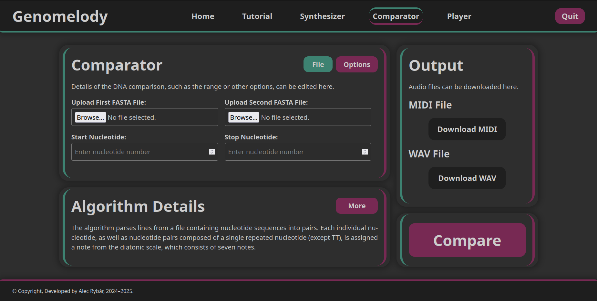
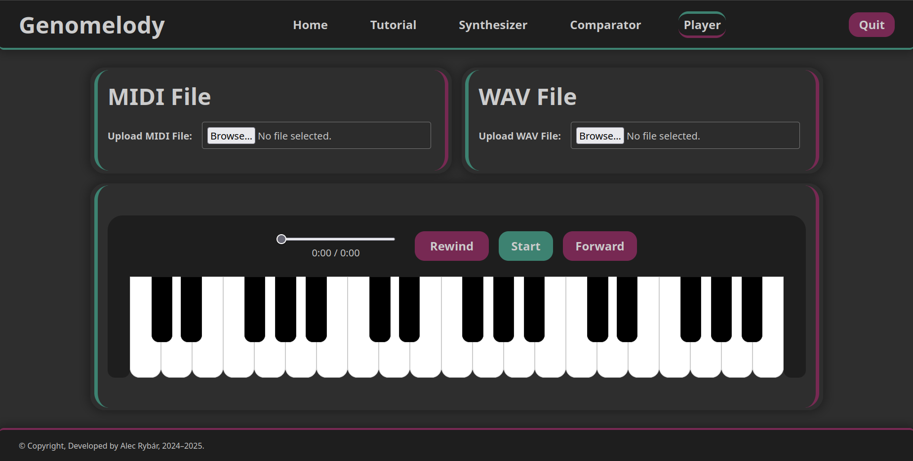

# Genomelody

**Genomelody** is a Python-based interactive application that transforms DNA sequences into music. By converting DNA data (in FASTA format) into MIDI and WAV audio formats, Genomelody creates a new way to experience genetic information through sound.

Built using the **Eel** library, it provides a browser graphical interface, allowing users to:
- Generate music from single DNA sequences
- Compare and fuse multiple DNA sequences musically
- Visualize audio with an interactive piano
- Download and play MIDI and WAV outputs

---

## Table of Contents

1. [Overview](#overview)
2. [Features](#features)
   - [Home Screen](#home-screen)
   - [Tutorial](#tutorial)
   - [Synthesizer](#synthesizer)
   - [Comparator](#comparator)
   - [Player](#player)
3. [Application Structure](#application-structure)
4. [Getting Started](#getting-started)
   - [Docker](#docker)
   - [Windows Executable](#windows-executable)
   - [Running from Source](#running-from-source)
   - [Optional Configuration](#optional-configuration)
5. [License](#license)

---

## Overview

Genomelody bridges the fields of **bioinformatics** and **audio synthesis**. It converts nucleotides into musical notes using custom algorithms. The application supports both MIDI output (for musical editing or playback) and WAV output (for general audio consumption).

It's designed for:
- Scientists and educators aiming to teach genomics creatively
- Musicians looking for unconventional inspiration
- Curious minds exploring the fusion of biology and art

---

## Features

### Home Screen

The landing page offers a gateway to all modules:  
**Tutorial**, **Synthesizer**, **Comparator**, and **Player**.

Each section is described briefly to help users choose the right tool:
- Tutorial: Step-by-step introduction
- Synthesizer: Convert DNA to music
- Comparator: Compare two sequences sonically
- Player: Play and visualize MIDI/WAV files



---

### Tutorial

The tutorial walks users through the complete process of generating music from a DNA file.

**Key Steps:**
- Upload a FASTA file
- Choose an instrument
- Select a line range to convert
- Pick conversion algorithm
- Set tempo in BPM
- Generate and preview MIDI/WAV output

It also shows basic information such as:
- File details
- Algorithm description
- Mapping preview



---

### Synthesizer

The synthesizer allows sequence to sound conversion.

**Options include:**
- Uploading a FASTA DNA file
- Selecting a mapping algorithm
- Picking tempo and instrument
- Defining the sequence range
- Generating MIDI and WAV files



---

### Comparator

This module is designed for comparative analysis of DNA sequences.

**Users can:**
- Upload two separate FASTA files
- Specify a nucleotide range
- Generate audio that fuses both sequences
- Listen to differences or similarities of sequnces



---

### Player

The Player tool lets you load and play MIDI and WAV files generated in Genomelody.

**Player Capabilities:**
- Upload MIDI and WAV files
- View progress and duration
- Rewind, start, or forward
- Visualize playback with a piano



---

## Application Structure

Genomelody is organized into a modular structure. The backend logic, audio conversion tools, and web-based interface are separated into specific folders to make development easier.

The application is organized into directories, structured as follows:

- **`binary/`** – Contains the Windows executable (`main.exe`) and the source code used to build it.
  - `main.exe`
  - `source/`

- **`converters/`** – Handles conversion of DNA data to MIDI and WAV formats.
  - `field_to_midi.py`
  - `midi_to_wav.py`

- **`mappings/`** – Implements algorithms to convert nucleotides into musical notes.
  - `nucleotides_to_binary.py`
  - `nucleotides_to_diatonic.py`
  - `nucleotides_to_chromatic.py`

- **`processors/`** – Processes FASTA files for conversion and comparison.
  - `processor_fasta.py`
  - `processor_double_fasta.py`

- **`soundfont/`** – Stores the SoundFont file used to produce audio.
  - `soundfont.sf2`

- **`examples/`** – Includes example DNA (BRCA1 - original gene/BRCA1-43045291A>C - mutated gene) and audio files.
  - `BRCA1.fasta`
  - `BRCA1-43045291A>C.fasta`
  - `sequence.fasta`
  - `sequence.mid`
  - `sequence.wav`


- **`web/`** – Contains the graphical web interface.
  - `index.html`
  - `tutorial.html`
  - `synthesizer.html`
  - `comparator.html`
  - `player.html`
  - `css/`
  - `js/`

- **`gui_controllers.py`** – Manages user interactions and triggers conversion.

- **`main.py`** – Launches the app and starts the GUI.

- **`Dockerfile`** – Configuration file for Docker.

- **`requirements.txt`** – Defines the dependencies.

---

## Getting Started

Genomelody can be run in three different ways:

- Docker container  
- Windows executable  
- From source code

Choose the method that best fits your preferences.

---

### Docker

Run Genomelody in a container without need to install additional software.

1. Build the Docker image:
   ```bash
   docker build -t genomelody .
   ```
2. Run the container:
   ```bash
   docker run -p 8000:8000 genomelody
   ```
3. Open your browser and go to:
   ```
   http://localhost:8000/index.html
   ```

---

### Windows Executable

Run Genomelody on Windows using the prebuilt executable.

> **Requires Microsoft Edge**  
> The Eel framework uses Edge as the webview.

1. Make sure Microsoft Edge is installed on your system.
2. Navigate to the `binary/` directory.
3. Double-click `main.exe` to start the app.
4. The application will launch in a desktop window.

---

### Running from Source

Run Genomelody directly from source code using Python 3.

> **Requires FluidSynth** and the Python libraries listed in `requirements.txt`

#### 1. Install FluidSynth

[FluidSynth](https://github.com/FluidSynth/fluidsynth/wiki/Download) is required to convert MIDI files into WAV audio. Make sure `fluidsynth` is available in your system PATH.

#### 2. Install Python Dependencies

Install required libraries using:

```bash
pip install -r requirements.txt
```

This includes:

- `eel` – for rendering the GUI in a browser  
- `mido` – for generating MIDI files  
- `midi2audio` – for converting MIDI to WAV via FluidSynth

#### 3. Run the Application

Launch the app using:

```bash
python main.py
```

By default, the app will open in your browser at:
```
http://localhost:8000/index.html
```

### Optional Configuration

You can customize GUI behavior by editing the `eel.start()` parameters in `main.py`:

- **Host**
  - `host="127.0.0.1"` – Restricts access to your local machine
  - `host="0.0.0.0"` – Allows access from other devices on your local network
  - You can also omit the `host` parameter to use the default setting

- **Port**
  - `port=8000` – Default port used to serve the app
  - You can also omit the `port` parameter to use the default setting

- **Mode**
  - `mode=None` – User must enter the address manually inside browser, because it doesn't open automatically
  - `mode="default"` – Opens the application in your default web browser

> These options allow you to control how and where the application runs.

---

## License

This project is licensed under the **GNU General Public License v3.0 (GPL-3.0)**.  
You are free to use, modify, and distribute this software under the terms of the GPL.

### Third-party Libraries and Tools

Genomelody uses the following open-source components to run or compile the executable:

- [FluidSynth](https://github.com/FluidSynth/fluidsynth) – **LGPL-2.1+**
- [GeneralUser GS SoundFont](https://schristiancollins.com/generaluser.php) – **Freeware License v2.0** by S. Christian Collins
- [Eel](https://github.com/python-eel/Eel) – **MIT License**
- [Mido](https://github.com/mido/mido) – **MIT License**
- [Midi2audio](https://github.com/bzamecnik/midi2audio) – **MIT License**
- [PyInstaller](https://github.com/pyinstaller/pyinstaller) – **GPL-2.0**

All libraries and tools are used in accordance with their licenses.

---

For more details, see the [LICENSE](LICENSE) file.