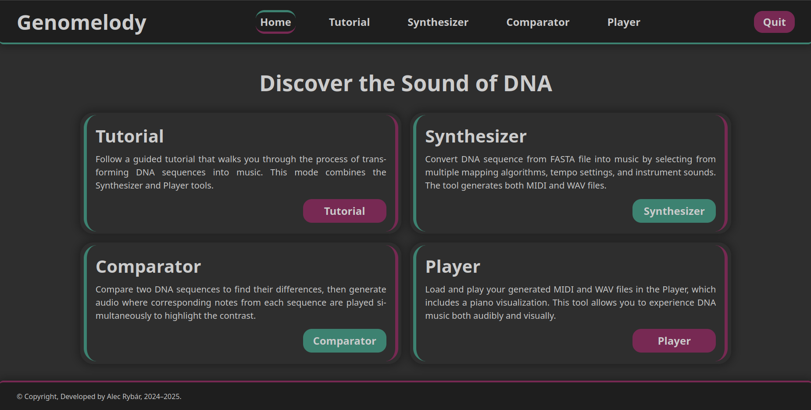
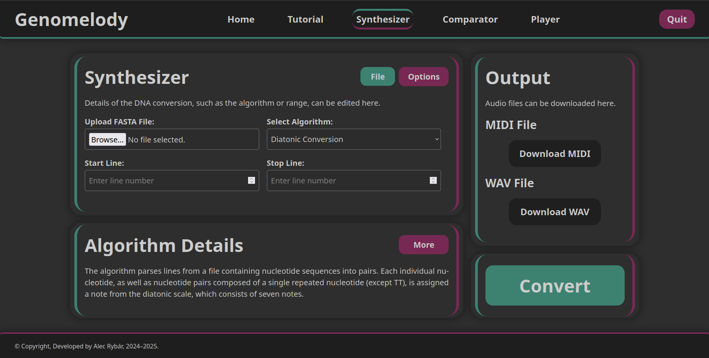

# Genomelody

Genomelody is a Python application that converts DNA sequences (in FASTA format) into MIDI and WAV audio files. The application also provides simple player with a piano visualization.

---

## Table of Contents
1. [Application Structure](#application-structure)
2. [Features](#features)
   - [Home Screen](#home-screen)
   - [Synthesizer](#synthesizer)
   - [Player](#player)
3. [Getting Started](#getting-started)
   - [Dependencies](#dependencies)
   - [First Run](#first-run)

---

## Application Structure

The application is organized into directories, structured as follows:

- **`converters/`**
  - `field_to_midi.py`
  - `midi_to_wav.py`  
  Contains conversion algorithms for MIDI and WAV file formats.

- **`mappings/`**
  - `nucleotides_to_diatonic.py`
  - `nucleotides_to_chromatic.py`  
  Implements algorithms for converting DNA sequences into musical notation.

- **`processors/`**
  - `processor_fasta.py`  
  Adapter module that reads FASTA files and applies selected algorithms.

- **`soundfont/`**
  - `soundfont.sf2`  
  Contains instrument sounds in SoundFont format.

- **`web/`**
  - `index.html`
  - `player.html`
  - `synthesizer.html`
  - `css/`
  - `js/`
  - `temp/`  
  Houses the graphical user interface and temporary files.

- **`main.py`**  
  The main entry point of the application. Initializes and launches the graphical interface.

---

## Features

### Home Screen
The home screen consists of two tiles:
- **Synthesizer**: Opens the DNA-to-MIDI/WAV conversion tool.
- **Player**: Opens the MIDI/WAV player with a piano visualization.



---

### Synthesizer
The synthesizer interface is split into:
- **Input Section**: Allows users to upload a DNA file (FASTA format) and configure conversion settings.
- **Output Section**: Provides generated audio files for download.



---

### Player
The player interface is divided into two sections:
- **Input Section**: Allows users to upload a MIDI and WAV file.
- **Piano Section**: Visualises piano playback for the MIDI and WAV file.


---

## Getting Started

### Dependencies
The application requires the installation of the free open-source software **FluidSynth** for audio synthesis. Download it from [FluidSynth Downloads](https://github.com/FluidSynth/fluidsynth/wiki/Download).

### First Run
1. Import **Genomelody** into your Python environment.
2. Install the required Python libraries:
   ```bash
   pip install -r requirements.txt
3. Run the application
   ```bash
   python main.py
